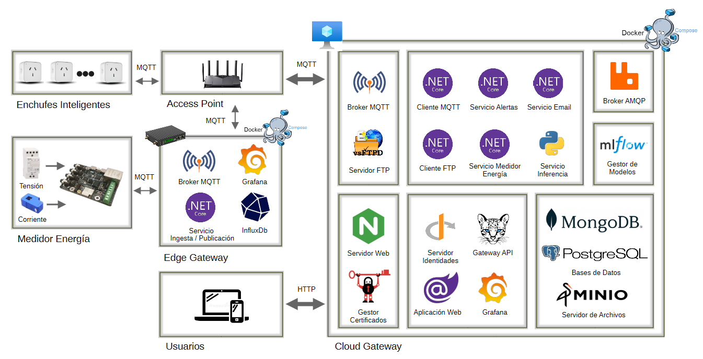

# Sistema de Monitoreo No Intrusivo de Cargas Eléctricas mediante Aprendizaje Profundo

Este repositorio contiene el desarrollo de un prototipo funcional de Monitoreo de Carga No Intrusivo (NILM) basado en IoT y Deep Learning. El objetivo principal es desagregar el consumo energético total de una instalación eléctrica domiciliaria a partir de un único punto de medición, eliminando la necesidad de instrumentar cada carga de forma individual.

El proyecto se desarrolla como Trabajo Final para la Maestría en Computación de Borde (FIUBA).

## 1. Introducción General

El Monitoreo de Carga No Intrusivo (NILM, por sus siglas en inglés) es una técnica de análisis de datos energéticos diseñada para identificar el consumo individual de los artefactos eléctricos procesando la señal capturada en un único punto de entrada de la red. 

A través del reconocimiento de firmas eléctricas (tales como transitorios de encendido, componentes armónicos y perfiles de estado estacionario), el sistema es capaz de deducir qué dispositivos están operando, en qué momento y cuánta energía están demandando.

En el contexto de la Eficiencia Energética y la Industria 4.0, la tecnología NILM resulta disruptiva por tres pilares fundamentales:
* Reducción de Costos: Minimiza la inversión en hardware y simplifica drásticamente la instalación al evitar medidores individuales.
* Escalabilidad: Permite desplegar de forma rápida soluciones masivas de gestión energética en la nube.
* Generación de Insights: Provee indicadores granulares que facilitan el cambio de hábitos, la optimización de la demanda y la detección temprana de fallas en activos críticos.

---

## 2. Descripción General del Sistema

A continuación se detalla la arquitectura en bloques planificada para el proyecto, la cual describe el flujo de datos desde la adquisición física hasta la inferencia y visualización por parte de los usuarios.

### Arquitectura en Bloques
Como referencia del diseño global del sistema, se plantea el siguiente esquema de arquitectura.

> **Nota:** El repositorio actualmente se encuentra en su fase inicial, focalizado en los componentes base de adquisición de datos y conectividad local que se detallan en la sección de estado actual.

---

## 3. Estado Actual del Desarrollo

Actualmente, el desarrollo en este repositorio se centra en la implementación y consolidación del entorno local de adquisición y preprocesamiento de datos.

### Medidor de Energía (Medición Consumo Principal)
Se emplea una placa **DitroniX EPEM E36** conectada a transformadores de tensión y corriente para la captura de datos del consumo agregado de la instalación.  La placa integra un chip de medición **Microchip ATM90E36A** para el cálculo interno de valores RMS, potencias y parámetros asociados a calidad de energía. Cuenta con un módulo **Espressif ESP32-C6-MINI-1U-H4** (RISC-V de 32 bits a 160 MHz) encargado de la ejecución del firmware de adquisición y conectividad MQTT.

### Enchufes Inteligentes (Medición de Cargas Individuales)
Se han integrado nodos de medición inalámbricos en cargas individuales mediante **Athom Smart Plugs**. Su función  es registrar de forma desagregada el estado (encendido/apagado) y la potencia activa de electrodomésticos específicos. Estos datos individuales son esenciales para crear un dataset etiquetado de entrenamiento y validación con el cual se entrenarán los modelos de aprendizaje profundo.

### Edge Gateway
El sistema dispone de un Edge Gateway que centraliza la comunicación local recibiendo la telemetría tanto del medidor de consumo principal como de los enchufes inteligentes mediante un Broker MQTT local.A través de un servicio de ingesta y publicación y almacenamiento temporal en InfluxDB, el gateway alinea temporalmente las lecturas y actúa como buffer para evitar pérdidas de información ante caídas de red. Optimiza el uso del ancho de banda empaquetando y transmitiendo los datos procesados en lotes hacia la plataforma en la nube. Incluye un panel local en Grafana para el monitoreo y validación visual inmediata en tiempo real de las variables eléctricas de los equipos vinculados.